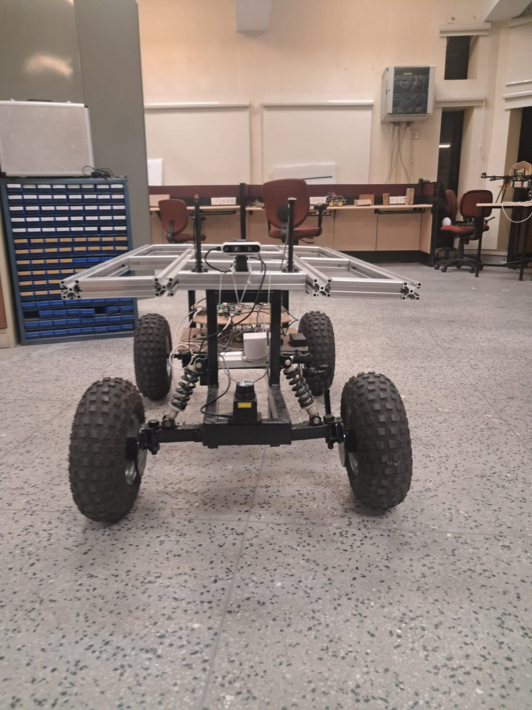
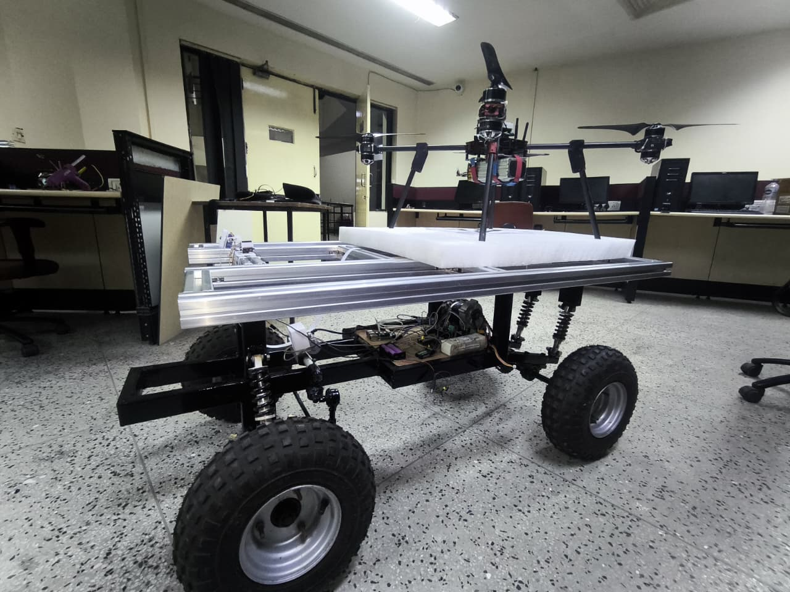

# Ackermann-Drive-UGV

This repository contains the ROS2 software stack and Gazebo simulation environment for a custom-built, Ackermann-steered Unmanned Ground Vehicle (UGV). The project focuses on robust localization, mapping, and autonomous navigation using advanced sensor fusion and path planning algorithms tailored for non-holonomic robots.

## Overview
Unlike standard differential drive robots, this UGV utilizes an Ackermann steering mechanism. The software architecture includes custom controllers to translate standard ROS Twist messages into Ackermann kinematics, enhanced odometry combining wheel encoders, IMU, and LiDAR, and full integration with the Nav2 stack for autonomous obstacle avoidance and goal-directed navigation.

## Software Stack & Algorithms
* **Path Planning (Smac Hybrid Planner):** To accommodate the non-holonomic constraints and minimum turning radius of the Ackermann steering system, the Nav2 stack utilizes the **Smac Planner Hybrid**. This algorithm generates kinematically feasible, smooth paths (using Reeds-Shepp or Dubins curves) ensuring the robot can reach its goal without requiring in-place rotations.
* **Localization & Sensor Fusion:** Employs an **Extended Kalman Filter (EKF)** via the `robot_localization` package. It fuses continuous data streams from custom wheel odometry scripts, an enhanced IMU processor, and a custom adaptive laser scan matcher to maintain highly accurate state estimation.
* **Mapping:** Integrates **SLAM Toolbox** for creating precise 2D occupancy grid maps of the simulation environment using LiDAR data.
* **Custom Behavior Trees:** Navigation is guided by specific XML behavior trees (`ackermann_to_bt.xml`, `ackermann_through_bt.xml`) optimized for continuous forward motion and reversing logic.

## Repository Structure
* **`bot_description`**: Contains the URDF/Xacro models, 3D sensor meshes (Camera, LiDAR), RViz configurations, and the Gazebo simulation world files (`living_room.sdf`).
* **`custom_ackermann_controller`**: The core package handling Ackermann kinematics, PS4 controller input, and the enhanced odometry/localization nodes (Adaptive Scan Matcher, IMU Processor).
* **`bot_navigation`**: Configuration files for Nav2 and SLAM, custom behavior trees, pre-generated maps (`my_map.yaml`), and the main navigation launch files.
* **`bot_controller`**: Basic movement and controller parameter configurations.

## Media
### Photos

#### Real Hardware Chassis
| Chassis View 1 | Chassis View 2 |
| :---: | :---: |
|  |  |

| UGV Simulation Model | Gazebo Environment |
| :---: | :---: |
|  |  |

### Videos
* **Autonomous Navigation in Gazebo - Goal 1:**


https://github.com/user-attachments/assets/7a7e66fb-3602-4c6d-b899-68dd6ec5567c


* **Autonomous Navigation in Gazebo - Goal 2:**


https://github.com/user-attachments/assets/eeff3caf-ddfd-4382-ad86-46505ce45fc5


## Installation
1. Clone the workspace:
```bash
mkdir -p ~/ugv_ws/src
cd ~/ugv_ws/src
git clone https://github.com/yenode/Ackermann-Drive-UGV.git
```

2. Install dependencies:
```bash
cd ~/ugv_ws
rosdep install --from-paths src --ignore-src -r -y
```

3. Build the workspace:
```bash
colcon build --symlink-install
source install/setup.bash
```

## Usage
1. Launch the simulation environment and robot state publisher:
```bash
ros2 launch bot_description gazebo.launch.xml
```

3. Launch the bot_controller:
```bash
ros2 launch bot_controller bot_controller.launch.xml
```

3. Launch the enhanced odometry and localization stack:
```bash
ros2 launch custom_ackermann_controller enhanced_localization.launch.py
```

4. Launch Navigation2 (for autonomous movement and obstacle avoidance):
```bash
ros2 launch bot_navigation navigation.launch.py
```

5. For manual teleoperation via PS4 controller:
```bash
ros2 launch custom_ackermann_controller joystick_teleop.launch.py
```

## License
This project is licensed under the MIT License.
